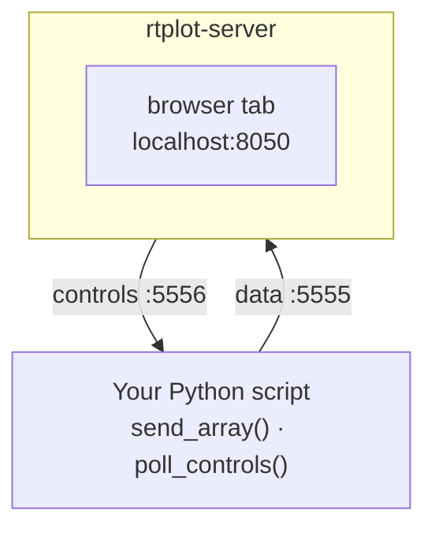
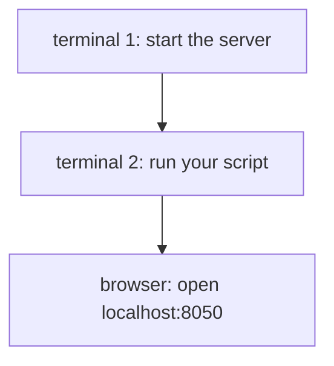

# rtplot — real-time plotting over ZMQ

**rtplot** pushes live data from a Python script to a browser plot —
locally or across a network — in a few lines of code. The plot page
also hosts interactive widgets (buttons, sliders, dials, numeric / text
displays) that feed values back to the sender in real time.

Typical use: a robot or data-acquisition script runs on a Raspberry Pi,
and you watch signals and tweak gains from a laptop on the same Wi-Fi.

---

## How it works

Two processes talking over ZMQ, plus a browser viewer:



Sender and server don't have to be on the same machine — see the
[networking guide](docs/networking.md).

---

## Install

**Server** — grab the prebuilt binary from the
[Releases page](https://github.com/jmontp/rtplot/releases):

| Platform | Asset |
|---|---|
| Windows | `rtplot-server-<version>-windows-x64.exe` |
| Linux | `rtplot-server-<version>-linux-x86_64.tar.gz` |
| macOS (Apple Silicon) | `rtplot-server-<version>-macos-arm64.tar.gz` |

No Python needed on the viewing machine. On Windows the binary opens
a small Tk status window showing the listening URL.

**Client** — pip install in the env that runs your script:

```bash
pip install better-rtplot
```

(If you'd rather run the server from Python too, use
`pip install "better-rtplot[browser]"` — see the
[API reference](docs/api.md#install-detail).)

---

## Your first plot



**Terminal 1 — start the server.** Run the prebuilt `rtplot-server`
binary you downloaded above. Open `http://localhost:8050` in a
browser — the page is blank until data arrives.

**Terminal 2 — run your sender script.** Save as `my_plot.py`:

```python
from rtplot import client
import time

client.local_plot()
client.initialize_plots(["my signal"])

for i in range(1000):
    client.send_array(i * 0.01)
    time.sleep(0.01)
```

```bash
python my_plot.py
```

A rising line now draws itself in the browser tab.

---

## Highlights

- **Fast.** Binary WebSocket deltas up to 1 kHz; the browser coalesces
  samples into one repaint per `requestAnimationFrame`, so rendering
  tracks your monitor refresh rate regardless of sample rate.
- **Browser-based.** aiohttp + uPlot, no desktop GUI toolkit, works
  over SSH port forwarding.
- **Remote-friendly.** Sender or plot host can bind. Live Bind /
  Connect buttons retarget without restart.
- **Config lives with the data.** The sender declares plot layout.
- **Interactive controls.** Buttons, sliders, dials, displays — polled
  from your loop, no threads, no callbacks.
- **Static HTML snapshots.** `save_snapshot("out.html")` writes a
  self-contained ~65 KB file with the current trace embedded.

---

## Where to go next

- **[API reference](docs/api.md)** — every `rtplot.client` function,
  the plot-layout schema, interactive controls, snapshots, browser UI,
  and `rtplot-server` CLI flags.
- **[Networking guide](docs/networking.md)** — Mode A vs. Mode B,
  viewing from a phone or second laptop, the WSL2 wrinkle, Cloudflare
  Tunnel, Tailscale.
- **[Examples](examples/README.md)** — runnable scripts with embedded
  HTML snapshots you can open offline.

---

Issues and feature requests:
[github.com/jmontp/rtplot/issues](https://github.com/jmontp/rtplot/issues).
