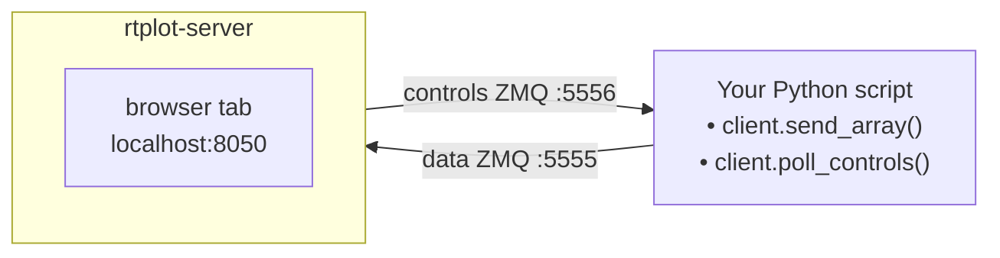
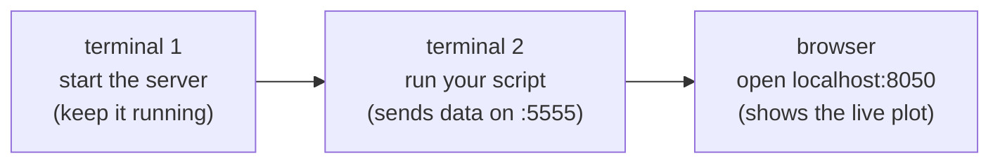
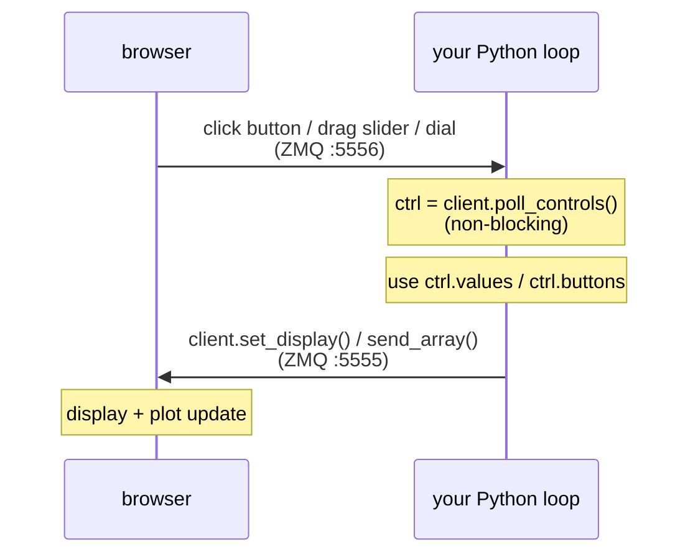
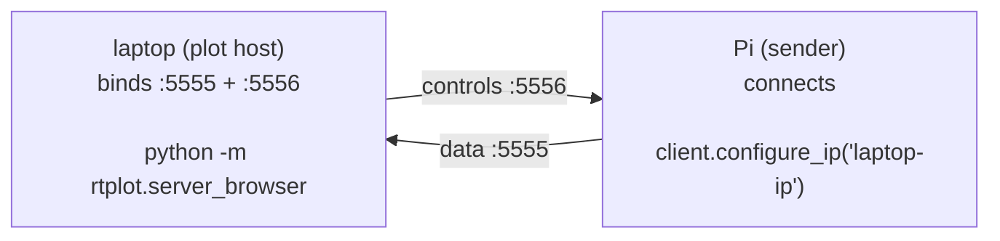
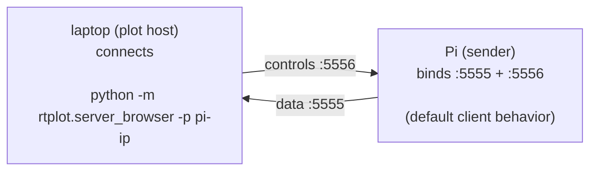
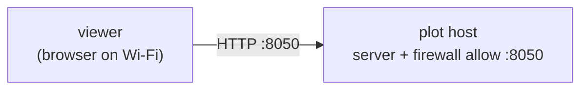
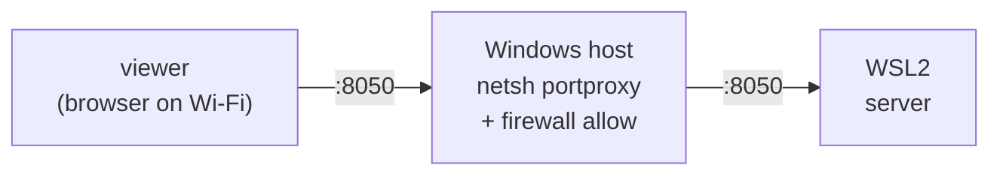
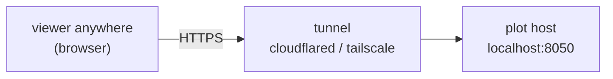

# rtplot — real-time plotting over ZMQ

**rtplot** pushes live data from a Python script to a browser plot —
locally or across a network — in a few lines of code. The plot page
also hosts interactive widgets (buttons, sliders, dials, numeric / text
displays) that feed values back to the sender in real time.

Typical use: a robot or data-acquisition script runs on a Raspberry Pi,
and you watch signals and tweak gains from a laptop on the same Wi-Fi.

Runnable examples with pre-rendered `snapshot.html` previews live in
[`examples/`](examples/).

---

## Table of contents

- [How it works](#how-it-works)
- [Your first plot, step by step](#your-first-plot-step-by-step)
- [Highlights](#highlights)
- [Install](#install)
- [Interactive controls](#interactive-controls)
- [Plot configuration](#plot-configuration)
- [Sending data](#sending-data)
- [Static HTML snapshots](#static-html-snapshots)
- [Browser UI features](#browser-ui-features)
- [Networking modes](#networking-modes)
- [Viewing the plot from another device](#viewing-the-plot-from-another-device)
- [Performance tuning](#performance-tuning)
- [CLI reference](#cli-reference)
- [Client API reference](#client-api-reference)
- [Examples gallery](#examples-gallery)

---

## How it works

Two processes talking over ZMQ, plus a browser viewer:



Sender and server don't have to be on the same machine — see
[Networking modes](#networking-modes).

---

## Your first plot, step by step



**Terminal 1 — start the server.** Easiest path: grab the prebuilt
`rtplot-server` binary for your platform from the
[Releases page](https://github.com/jmontp/rtplot/releases) and run
it. No Python needed on the viewing machine; on Windows a small Tk
status window opens showing the `http://localhost:8050` URL. Open
that URL in a browser — the page is blank until data arrives.

<details>
<summary>Or run from pip, if you already have Python here</summary>

```bash
pip install "better-rtplot[browser]"
python -m rtplot.server_browser
```
</details>

**Terminal 2 — run your sender script.** Install the client library
(tiny; no server deps):

```bash
pip install better-rtplot
```

Save as `my_plot.py` and run it:

```python
from rtplot import client
import time

client.local_plot()
client.initialize_plots(["my signal"])

for i in range(1000):
    client.send_array(i * 0.01)
    time.sleep(0.01)
```

A rising line now draws itself in the browser tab.

---

## Highlights

- **Fast.** Binary WebSocket deltas up to 1 kHz; the browser coalesces
  samples into one repaint per `requestAnimationFrame`, so rendering
  tracks your monitor refresh rate regardless of sample rate.
- **Browser-based.** aiohttp + uPlot, no desktop GUI toolkit, works
  over SSH port forwarding.
- **Remote-friendly.** Sender or plot host can bind. Live Bind /
  Connect buttons retarget without restart.
- **Config lives with the data.** The sender declares plot layout.
- **Interactive controls.** Buttons, sliders, dials, displays — polled
  from your loop, no threads, no callbacks.
- **Static HTML snapshots.** `save_snapshot("out.html")` writes a
  self-contained ~65 KB file with the current trace embedded.

---

## Install

### Server — prebuilt binary (recommended)

Download `rtplot-server` from the
[Releases page](https://github.com/jmontp/rtplot/releases) and run it
directly. No Python needed on the viewing machine.

| Platform | Asset |
|---|---|
| Windows | `rtplot-server-<version>-windows-x64.exe` |
| Linux | `rtplot-server-<version>-linux-x86_64.tar.gz` |
| macOS (Apple Silicon) | `rtplot-server-<version>-macos-arm64.tar.gz` |

On Windows the binary opens a small Tk status window (listening URL,
ZMQ status, demo sender, collapsible log).

### Client — pip

```bash
pip install better-rtplot              # sender-only (typical)
pip install "better-rtplot[browser]"   # server + client in one env
```

Use the `[browser]` extra only if you also want to run the server from
Python (e.g. headless CI, or a host that already has Python set up).
Without it, launching the server raises a clear error pointing you at
the extra.

---

## Interactive controls

Control events flow back to your loop over ZMQ `:5556`:



Declare controls inline in your plot layout:

```python
from rtplot import client
import numpy as np, time

client.local_plot()
client.initialize_plots([
    {"names": ["signal"], "yrange": [-6, 6]},
    {"controls": [
        {"type": "button", "id": "reset", "label": "Reset"},
        {"type": "button", "id": "pause", "label": "Pause"},
        {"type": "slider", "id": "gain",  "label": "Gain",
         "min": 0, "max": 5, "value": 1.0, "step": 0.1, "format": "{:.2f}"},
    ]},
    {"controls": [
        {"type": "dial",    "id": "freq", "label": "Freq (Hz)",
         "min": 0.1, "max": 5.0, "value": 1.0, "step": 0.05,
         "sensitivity": 0.5, "format": "{:.2f}"},
        {"type": "display", "id": "t",    "label": "t (s)", "format": "{:.2f}"},
        {"type": "text",    "id": "msg",  "label": "Status", "value": "running"},
    ]},
])

running, t0 = True, time.time()
while True:
    ctrl = client.poll_controls()
    for btn in ctrl.buttons:
        if btn == "reset": t0 = time.time()
        if btn == "pause": running = not running

    gain = ctrl.values.get("gain", 1.0)
    freq = ctrl.values.get("freq", 1.0)
    t    = time.time() - t0
    amp  = gain * np.sin(2 * np.pi * freq * t) if running else 0.0

    client.set_display("t", t)
    client.set_display("msg", "running" if running else "paused")
    client.send_array(amp)
    time.sleep(0.01)
```

`poll_controls()` returns `ControlState(values, buttons)`:

- `values` — `{id: float}` for every slider/dial. Defaults from
  `initialize_plots` are pre-seeded, so the first call already has them.
- `buttons` — list of button ids fired since the last poll, in order.
  Cleared on return, so each press is delivered exactly once.

`set_display(id, value)` takes a number for `display` elements or a
string for `text` elements. Updates are coalesced at ~30 Hz.

### Element reference

| Type | Purpose | Notable fields |
|---|---|---|
| `button` | Discrete event on click | `id`, `label`, `height` |
| `slider` | Scalar input, horizontal range | `id`, `label`, `min`, `max`, `value`, `step`, `format`, `height` |
| `dial` | Scalar input, vertical drag | same as slider, plus `sensitivity` (rotations per range; default `1.0`) |
| `display` | Read-only numeric readout | `id`, `label`, `format`, `height` |
| `text` | Read-only text field | `id`, `label`, `value`, `height` |

Sliders and dials render as `[widget] [−] [number input] [+]` — drag,
type, or nudge by `step`. Dial `sensitivity: 1.0` maps one rotation to
the full range; `0.25` needs four rotations for finer control.

`format` accepts Python `{:.Nf}` strings. `height` is a row-height
multiplier (default `1`); use `2` for a double-tall dial or button.

See [`examples/03_interactive_controls/`](examples/03_interactive_controls/)
for a runnable walkthrough.

---

## Plot configuration

Each entry in `initialize_plots` is one of:

| Form | Result |
|---|---|
| `3` | one plot, 3 anonymous traces |
| `"torque"` | one plot, one named trace |
| `["a", "b"]` | one plot, one trace per name |
| `[["a"], ["b", "c"]]` | one plot per sublist |
| `{...}` | one styled plot (keys below) |
| `[{...}, {...}]` | multiple styled plots |

Styled-plot dict keys:

| Key | Meaning |
|---|---|
| `names` | **Required.** List of trace names. |
| `colors` | Per-trace: letter (`r g b c m y k w`) or CSS string. |
| `line_style` | `"-"` dashed, else solid. |
| `line_width` | Line width in pixels. |
| `title` | Plot title. |
| `xlabel` / `ylabel` | Axis labels. |
| `yrange` | `[ymin, ymax]` — pins Y and speeds up rendering a lot. |
| `xrange` | Samples visible at once (default 200). |
| `height` | Per-plot height multiplier (default `1.0`). |

`{"controls": [...]}` as an entry adds a row of [interactive
controls](#interactive-controls) in place of a plot.

---

## Sending data

```python
client.send_array(scalar)            # float
client.send_array([a, b, c])         # 1-D: one sample per trace
client.send_array(np.array([...]))   # 1-D numpy: one sample per trace
client.send_array(np.array([[...]])) # 2-D (num_traces, N): batch of N
```

2-D batching is the fastest way to push many samples without dropping
frames.

---

## Static HTML snapshots

rtplot doesn't persist runs — it's a live-plot tool, not a logger. To
freeze a moment:

```python
client.save_snapshot("preview.html", animate=True)
```

Writes a self-contained ~65 KB file (uPlot JS/CSS inlined, current
trace window embedded). Opens offline anywhere. Controls aren't
captured. `animate=True` embeds a replay loop for gallery previews.

`server_url` defaults to `http://localhost:8050`; set it for a remote
server or non-default `--port`.

---

## Browser UI features

**Header bar**

| Element | What it does |
|---|---|
| Status pill | Live data + render rate; red when the stream is unhealthy. |
| `ZMQ …` indicator | Shows bind vs. connect state (`bind *:5555` or `→ host:port`). |
| IP input | Type `host[:port]` to retarget. |
| **Connect** / **Bind** | Flip modes live; active mode highlighted. |
| WebSocket status | Browser-to-server link, not ZMQ. |
| **☰** | Open settings panel. |

**Settings panel (☰)**

| Setting | Meaning |
|---|---|
| UI font scale | 0.7× – 2.0× text multiplier (demos, projectors, high-DPI). |
| Visible samples per plot | Override declared `xrange` without touching the sender. |
| Max plot refresh rate | Cap repaints at N Hz; reports the monitor's measured rate. |

Persisted in `localStorage`; **Reset to defaults** clears them.

---

## Networking modes

Either side can bind the ZMQ socket — pick what fits your firewalls. You
can also flip live from the UI's **Bind** / **Connect** buttons.

**Mode A — plot host binds** *(common: laptop in the lab)*



**Mode B — sender binds** *(common: Pi has the static IP)*



`-p host:port` on the server sets data (`port`) and control (`port+1`)
together, so sliders/buttons work in either mode without extra config.

---

## Viewing the plot from another device

This is about the **viewer** side — a phone, tablet, or second laptop
that just wants to open the browser UI. The plot host already serves
HTTP on `:8050` bound to every interface; you just need traffic to
reach it.

### On the same LAN



1. Get the plot host's LAN IP:

   ```powershell
   ipconfig | findstr IPv4       # Windows
   ```
   ```bash
   ip -4 addr | grep inet        # Linux / WSL
   ```

2. Open `http://<lan_ip>:8050` on the viewer.

3. Windows only: allow inbound `:8050`. The first server launch pops a
   Defender dialog — tick **Private networks**, **Allow**. To add it
   manually:

   ```powershell
   # PowerShell as Administrator
   New-NetFirewallRule -DisplayName "rtplot" `
       -Direction Inbound -LocalPort 8050 -Protocol TCP `
       -Action Allow -Profile Private
   ```

   Remove: `Remove-NetFirewallRule -DisplayName "rtplot"`.

### WSL2 wrinkle



WSL2's auto-forward only routes `localhost` from the Windows host, not
LAN traffic. Add a Windows-side port proxy:

```powershell
# PowerShell as Administrator
$wslIp = (wsl hostname -I).Trim().Split()[0]
netsh interface portproxy add v4tov4 `
    listenport=8050 listenaddress=0.0.0.0 `
    connectport=8050 connectaddress=$wslIp
New-NetFirewallRule -DisplayName "rtplot wsl" `
    -Direction Inbound -LocalPort 8050 -Protocol TCP `
    -Action Allow -Profile Private
```

WSL2 IPs change on reboot — rerun the `netsh` line after one. Undo:

```powershell
netsh interface portproxy delete v4tov4 listenport=8050 listenaddress=0.0.0.0
Remove-NetFirewallRule -DisplayName "rtplot wsl"
```

### Across the internet



**Cloudflare Tunnel** (one-shot URL, no router changes):

```powershell
winget install --id Cloudflare.cloudflared
cloudflared tunnel --url http://localhost:8050
```

Prints `https://<random>.trycloudflare.com`, valid until you kill the
command.

**Tailscale** (private mesh VPN, best for recurring setups): install on
both ends; each device gets a stable `100.x.y.z` IP. Open
`http://100.x.y.z:8050` on the viewer.

### Ports at a glance

| Port | What | Open to viewer? |
|---|---|---|
| `8050` TCP | HTTP + WebSocket (browser UI) | **yes** |
| `5555` TCP | ZMQ data (sender → server) | no — sender ↔ plot host only |
| `5556` TCP | ZMQ controls (server → sender) | no — sender ↔ plot host only |

---

## Performance tuning

Try these in order:

1. **Pin `yrange`** — biggest single win; skips autoscaling.
2. **Batch samples** — pass a 2-D numpy array to `send_array`.
3. **Cap refresh rate** from the ☰ menu (buffers keep filling; only
   repaints are throttled).
4. **Shrink the window** — fewer pixels to redraw.
5. **Reduce `line_width`.**
6. **`-n N` / `--skip N`** — push every Nth batch. Add `-a` /
   `--adaptable` to auto-tune.
7. **Increase `xrange`** — counterintuitively often cheaper, since the
   browser ring-buffers and only replaces the tail.

---

## CLI reference

`python -m rtplot.server_browser` accepts:

| Flag | Default | Meaning |
|---|---|---|
| `-p HOST[:PORT]` / `--pi_ip` | (bind) | Connect outbound to a sender instead of binding |
| `--host HOST` | `0.0.0.0` | HTTP bind interface |
| `--port N` | `8050` | HTTP port |
| `--no-browser` | off | Don't auto-open a browser on startup |
| `--rate N` | `1000` | Max WebSocket push rate (Hz) |
| `-n N` / `--skip N` | `1` | Push every Nth sample batch |
| `-a` / `--adaptable` | off | Auto-tune skip rate to data rate |
| `-c` / `--column` | row | Lay plots in columns instead of rows |
| `-d` / `--debug` | off | Extra debug logging |

---

## Client API reference

All from `rtplot.client`:

| Function | Purpose |
|---|---|
| `local_plot()` | Point at `127.0.0.1:5555`. Shorthand for `configure_ip("127.0.0.1")`. |
| `plot_to_neurobionics_tv()` | Point at the lab wall display (`141.212.77.23:5555`). |
| `configure_ip(ip)` | Connect to `ip`, `host:port`, or `tcp://host:port`. Also connects the control socket to `port+1`. |
| `configure_port(port)` | Rebind the publisher locally (bind-mode senders). |
| `initialize_plots(desc)` | Declare layout (see [Plot configuration](#plot-configuration)). |
| `send_array(A)` | Push samples: float, list, 1-D or 2-D `(num_traces, N)` numpy. |
| `set_display(id, value)` | Update a `display` (numeric) or `text` (string) element. |
| `poll_controls()` | Drain the return channel; returns `ControlState(values, buttons)`. |
| `save_snapshot(path, server_url=None, animate=False)` | Download a self-contained HTML snapshot to `path`. |

---

## Examples gallery

Each folder in [`examples/`](examples/) has `run.py`, a `README.md`,
and a pre-generated `snapshot.html` you can open offline.

| Example | Teaches |
|---|---|
| [`examples/01_hello_world/`](examples/01_hello_world/) | The minimum three calls — `local_plot`, `initialize_plots`, `send_array`. |
| [`examples/02_multiple_subplots/`](examples/02_multiple_subplots/) | Multi-plot layouts, per-plot styling, flat-list `send_array`. |
| [`examples/03_interactive_controls/`](examples/03_interactive_controls/) | Buttons, sliders, dials, and displays driving your loop live. |

Run any example: server in one terminal, `python run.py` in another.
See [`examples/README.md`](examples/README.md) for details.

For a manual end-to-end smoke test of the control palette,
[`rtplot/interactive_test.py`](rtplot/interactive_test.py) walks a
human through every widget:

```bash
python -m rtplot.server_browser &
python -m rtplot.interactive_test
```
