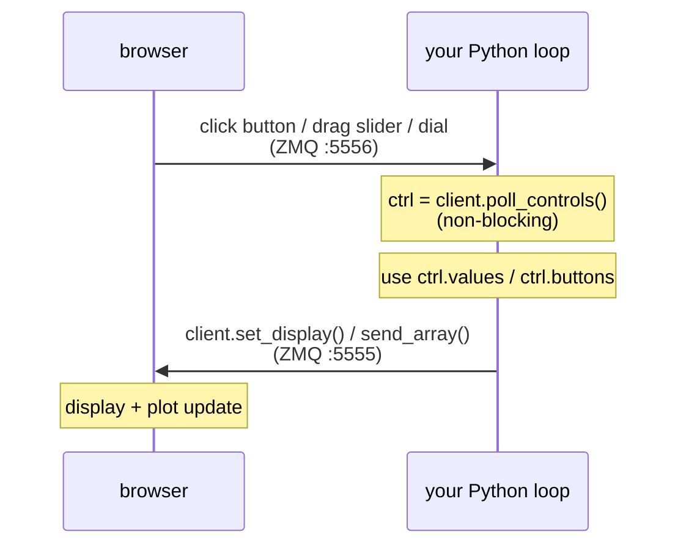

# rtplot API reference

← [README](../README.md) · [Networking guide](networking.md) · [Examples](../examples/README.md)

Everything you can call from `rtplot.client`, plus the plot-layout
schema, the browser UI, and the `rtplot-server` CLI.

---

## Table of contents

- [Client API](#client-api)
- [Plot configuration](#plot-configuration)
- [Sending data](#sending-data)
- [Interactive controls](#interactive-controls)
- [Static HTML snapshots](#static-html-snapshots)
- [Browser UI features](#browser-ui-features)
- [CLI reference](#cli-reference)
- [Install detail](#install-detail)

---

## Client API

All from `rtplot.client`:

| Function | Purpose |
|---|---|
| `local_plot()` | Point at `127.0.0.1:5555`. Shorthand for `configure_ip("127.0.0.1")`. |
| `configure_ip(ip)` | Connect to `ip`, `host:port`, or `tcp://host:port`. Also connects the control socket to `port+1`. |
| `configure_port(port)` | Rebind the publisher locally (bind-mode senders). |
| `initialize_plots(desc)` | Declare layout (see [Plot configuration](#plot-configuration)). |
| `send_array(A)` | Push samples: float, list, 1-D or 2-D `(num_traces, N)` numpy. |
| `set_display(id, value)` | Update a `display` (numeric) or `text` (string) element. |
| `poll_controls()` | Drain the return channel; returns `ControlState(values, buttons)`. |
| `save_snapshot(path, server_url=None, animate=False)` | Download a self-contained HTML snapshot to `path`. |

---

## Plot configuration

Each entry in `initialize_plots` is one of:

| Form | Result |
|---|---|
| `3` | one plot, 3 anonymous traces |
| `"torque"` | one plot, one named trace |
| `["a", "b"]` | one plot, one trace per name |
| `[["a"], ["b", "c"]]` | one plot per sublist |
| `{...}` | one styled plot (keys below) |
| `[{...}, {...}]` | multiple styled plots |

Styled-plot dict keys:

| Key | Meaning |
|---|---|
| `names` | **Required.** List of trace names. |
| `colors` | Per-trace: letter (`r g b c m y k w`) or CSS string. |
| `line_style` | `"-"` dashed, else solid. |
| `line_width` | Line width in pixels. |
| `title` | Plot title. |
| `xlabel` / `ylabel` | Axis labels. |
| `yrange` | `[ymin, ymax]` — pins Y and speeds up rendering a lot. |
| `xrange` | Samples visible at once (default 200). |
| `height` | Per-plot height multiplier (default `1.0`). |

`{"controls": [...]}` as an entry adds a row of [interactive
controls](#interactive-controls) in place of a plot.

### Typed form (dataclasses)

`initialize_plots` also accepts typed objects from `rtplot.client` for
the same configuration. Use whichever form you prefer — both serialize
to the identical on-the-wire dict, and they can be mixed freely in a
single call.

| Dict key(s) | Typed equivalent |
|---|---|
| `{"names": [...], ...}` | `Plot(names=[...], ...)` |
| `{"controls": [...]}` | `ControlsRow([...])` |
| `{"type": "button", "id": "...", "label": "..."}` | `Button(id, label, height=None)` |
| `{"type": "slider", ...}` | `Slider(id, label, min, max, value=0.0, step=None, format=None, height=None)` |
| `{"type": "dial", ...}` | `Dial(id, label, min, max, value=0.0, step=None, sensitivity=None, format=None, height=None)` |
| `{"type": "display", ...}` | `Display(id, label, format=None, height=None)` |
| `{"type": "text", ...}` | `Text(id, label, value="", height=None)` |

```python
from rtplot.client import Plot, ControlsRow, Button, Slider

client.initialize_plots([
    Plot(names=["signal"], yrange=(-6, 6), title="demo"),
    ControlsRow([
        Button("reset", "Reset"),
        Slider("gain", "Gain", min=0, max=5, value=1.0),
    ]),
])
```

Why you might prefer the typed form: editor autocomplete, `TypeError`
on unknown keys (instead of silently-ignored typos), and required
fields enforced at call time. The dict form stays supported — use it
for quick scripts or when the layout comes from a config file.

`yrange` / `xrange` accept tuples on the dataclass and lists on the
dict form; both go over the wire as JSON lists.

See
[`examples/04_typed_configuration/`](../examples/04_typed_configuration/)
for a runnable side-by-side with example 03.

---

## Sending data

```python
client.send_array(scalar)            # float
client.send_array([a, b, c])         # 1-D: one sample per trace
client.send_array(np.array([...]))   # 1-D numpy: one sample per trace
client.send_array(np.array([[...]])) # 2-D (num_traces, N): batch of N
```

2-D batching is the fastest way to push many samples without dropping
frames.

---

## Interactive controls

Control events flow back to your loop over ZMQ `:5556`:



Declare controls inline in your plot layout:

```python
from rtplot import client
import numpy as np, time

client.local_plot()
client.initialize_plots([
    {"names": ["signal"], "yrange": [-6, 6]},
    {"controls": [
        {"type": "button", "id": "reset", "label": "Reset"},
        {"type": "button", "id": "pause", "label": "Pause"},
        {"type": "slider", "id": "gain",  "label": "Gain",
         "min": 0, "max": 5, "value": 1.0, "step": 0.1, "format": "{:.2f}"},
    ]},
    {"controls": [
        {"type": "dial",    "id": "freq", "label": "Freq (Hz)",
         "min": 0.1, "max": 5.0, "value": 1.0, "step": 0.05,
         "sensitivity": 0.5, "format": "{:.2f}"},
        {"type": "display", "id": "t",    "label": "t (s)", "format": "{:.2f}"},
        {"type": "text",    "id": "msg",  "label": "Status", "value": "running"},
    ]},
])

running, t0 = True, time.time()
while True:
    ctrl = client.poll_controls()
    for btn in ctrl.buttons:
        if btn == "reset": t0 = time.time()
        if btn == "pause": running = not running

    gain = ctrl.values.get("gain", 1.0)
    freq = ctrl.values.get("freq", 1.0)
    t    = time.time() - t0
    amp  = gain * np.sin(2 * np.pi * freq * t) if running else 0.0

    client.set_display("t", t)
    client.set_display("msg", "running" if running else "paused")
    client.send_array(amp)
    time.sleep(0.01)
```

`poll_controls()` returns `ControlState(values, buttons)`:

- `values` — `{id: float}` for every slider/dial. Defaults from
  `initialize_plots` are pre-seeded, so the first call already has them.
- `buttons` — list of button ids fired since the last poll, in order.
  Cleared on return, so each press is delivered exactly once.

`set_display(id, value)` takes a number for `display` elements or a
string for `text` elements. Updates are coalesced at ~30 Hz.

### Element reference

| Type | Purpose | Notable fields |
|---|---|---|
| `button` | Discrete event on click | `id`, `label`, `height` |
| `slider` | Scalar input, horizontal range | `id`, `label`, `min`, `max`, `value`, `step`, `format`, `height` |
| `dial` | Scalar input, vertical drag | same as slider, plus `sensitivity` (rotations per range; default `1.0`) |
| `display` | Read-only numeric readout | `id`, `label`, `format`, `height` |
| `text` | Read-only text field | `id`, `label`, `value`, `height` |

Sliders and dials render as `[widget] [−] [number input] [+]` — drag,
type, or nudge by `step`. Dial `sensitivity: 1.0` maps one rotation to
the full range; `0.25` needs four rotations for finer control.

`format` accepts Python `{:.Nf}` strings. `height` is a row-height
multiplier (default `1`); use `2` for a double-tall dial or button.

See [`examples/03_interactive_controls/`](../examples/03_interactive_controls/)
for a runnable walkthrough.

For a manual end-to-end smoke test of the control palette,
[`rtplot/interactive_test.py`](../rtplot/interactive_test.py) walks a
human through every widget:

```bash
python -m rtplot.server_browser &
python -m rtplot.interactive_test
```

---

## Static HTML snapshots

rtplot doesn't persist runs — it's a live-plot tool, not a logger. To
freeze a moment:

```python
client.save_snapshot("preview.html", animate=True)
```

Writes a self-contained ~65 KB file (uPlot JS/CSS inlined, current
trace window embedded). Opens offline anywhere. Controls aren't
captured. `animate=True` embeds a replay loop for gallery previews.

`server_url` defaults to `http://localhost:8050`; set it for a remote
server or non-default `--port`.

---

## Browser UI features

**Header bar**

| Element | What it does |
|---|---|
| Status pill | Live data + render rate; red when the stream is unhealthy. |
| `ZMQ …` indicator | Shows bind vs. connect state (`bind *:5555` or `→ host:port`). |
| IP input | Type `host[:port]` to retarget. |
| **Connect** / **Bind** | Flip modes live; active mode highlighted. |
| WebSocket status | Browser-to-server link, not ZMQ. |
| **☰** | Open settings panel. |

**Settings panel (☰)**

| Setting | Meaning |
|---|---|
| UI font scale | 0.7× – 2.0× text multiplier (demos, projectors, high-DPI). |
| Visible samples per plot | Override declared `xrange` without touching the sender. |
| Max plot refresh rate | Cap repaints at N Hz; reports the monitor's measured rate. |

Persisted in `localStorage`; **Reset to defaults** clears them.

---

## CLI reference

`python -m rtplot.server_browser` accepts:

| Flag | Default | Meaning |
|---|---|---|
| `-p HOST[:PORT]` / `--pi_ip` | (bind) | Connect outbound to a sender instead of binding |
| `--host HOST` | `0.0.0.0` | HTTP bind interface |
| `--port N` | `8050` | HTTP port |
| `--no-browser` | off | Don't auto-open a browser on startup |
| `--rate N` | `1000` | Max WebSocket push rate (Hz) |
| `-n N` / `--skip N` | `1` | Push every Nth sample batch |
| `-a` / `--adaptable` | off | Auto-tune skip rate to data rate |
| `-c` / `--column` | row | Lay plots in columns instead of rows |
| `-d` / `--debug` | off | Extra debug logging |

---

## Install detail

```bash
pip install better-rtplot              # sender-only (typical)
pip install "better-rtplot[browser]"   # server + client in one env
```

Use the `[browser]` extra only if you also want to run the server from
Python (e.g. headless CI, or a host that already has Python set up).
Without it, launching the server raises a clear error pointing you at
the extra.
