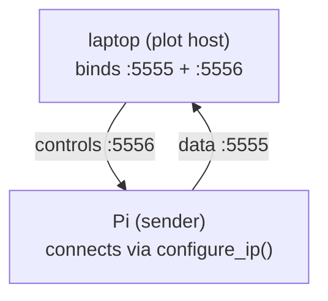
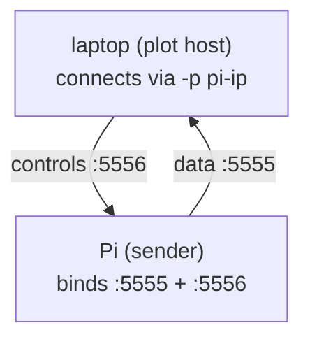
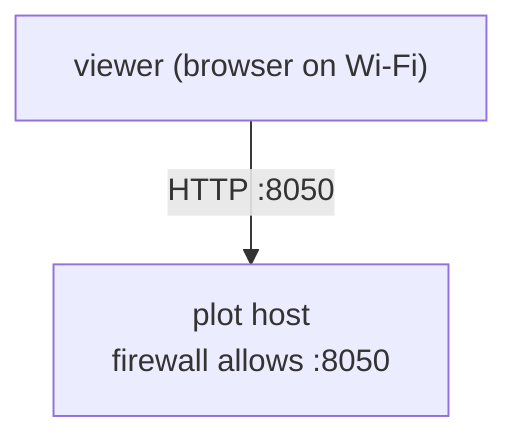
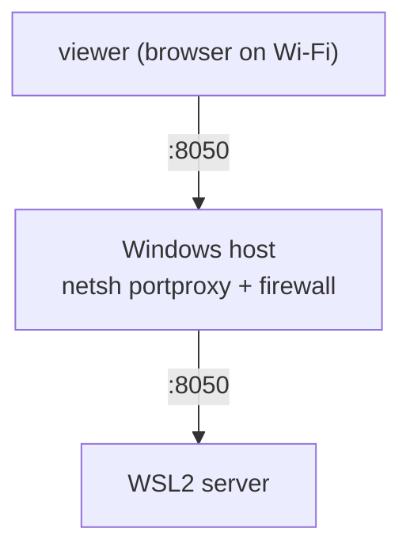
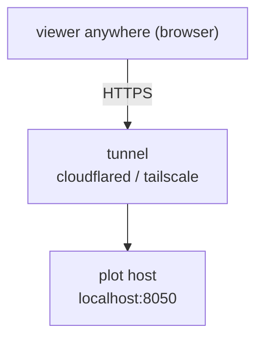

# rtplot networking guide

← [README](../README.md) · [API reference](api.md) · [Examples](../examples/README.md)

How to wire the sender, the plot host, and the viewer when they
aren't all the same machine.

---

## Table of contents

- [Networking modes](#networking-modes)
- [Viewing the plot from another device](#viewing-the-plot-from-another-device)
- [Ports at a glance](#ports-at-a-glance)

---

## Networking modes

Either side can bind the ZMQ socket — pick what fits your firewalls. You
can also flip live from the UI's **Bind** / **Connect** buttons.

**Mode A — plot host binds** *(common: laptop in the lab)*



**Mode B — sender binds** *(common: Pi has the static IP)*



`-p host:port` on the server sets data (`port`) and control (`port+1`)
together, so sliders/buttons work in either mode without extra config.

---

## Viewing the plot from another device

This is about the **viewer** side — a phone, tablet, or second laptop
that just wants to open the browser UI. The plot host already serves
HTTP on `:8050` bound to every interface; you just need traffic to
reach it.

### On the same LAN



1. Get the plot host's LAN IP:

   ```powershell
   ipconfig | findstr IPv4       # Windows
   ```
   ```bash
   ip -4 addr | grep inet        # Linux / WSL
   ```

2. Open `http://<lan_ip>:8050` on the viewer.

3. Windows only: allow inbound `:8050`. The first server launch pops a
   Defender dialog — tick **Private networks**, **Allow**. To add it
   manually:

   ```powershell
   # PowerShell as Administrator
   New-NetFirewallRule -DisplayName "rtplot" `
       -Direction Inbound -LocalPort 8050 -Protocol TCP `
       -Action Allow -Profile Private
   ```

   Remove: `Remove-NetFirewallRule -DisplayName "rtplot"`.

### WSL2 wrinkle



WSL2's auto-forward only routes `localhost` from the Windows host, not
LAN traffic. Add a Windows-side port proxy:

```powershell
# PowerShell as Administrator
$wslIp = (wsl hostname -I).Trim().Split()[0]
netsh interface portproxy add v4tov4 `
    listenport=8050 listenaddress=0.0.0.0 `
    connectport=8050 connectaddress=$wslIp
New-NetFirewallRule -DisplayName "rtplot wsl" `
    -Direction Inbound -LocalPort 8050 -Protocol TCP `
    -Action Allow -Profile Private
```

WSL2 IPs change on reboot — rerun the `netsh` line after one. Undo:

```powershell
netsh interface portproxy delete v4tov4 listenport=8050 listenaddress=0.0.0.0
Remove-NetFirewallRule -DisplayName "rtplot wsl"
```

### Across the internet



**Cloudflare Tunnel** (one-shot URL, no router changes):

```powershell
winget install --id Cloudflare.cloudflared
cloudflared tunnel --url http://localhost:8050
```

Prints `https://<random>.trycloudflare.com`, valid until you kill the
command.

**Tailscale** (private mesh VPN, best for recurring setups): install on
both ends; each device gets a stable `100.x.y.z` IP. Open
`http://100.x.y.z:8050` on the viewer.

---

## Ports at a glance

| Port | What | Open to viewer? |
|---|---|---|
| `8050` TCP | HTTP + WebSocket (browser UI) | **yes** |
| `5555` TCP | ZMQ data (sender → server) | no — sender ↔ plot host only |
| `5556` TCP | ZMQ controls (server → sender) | no — sender ↔ plot host only |
