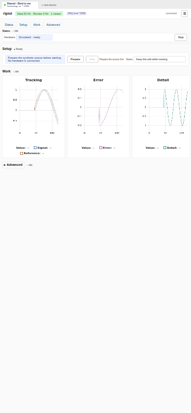
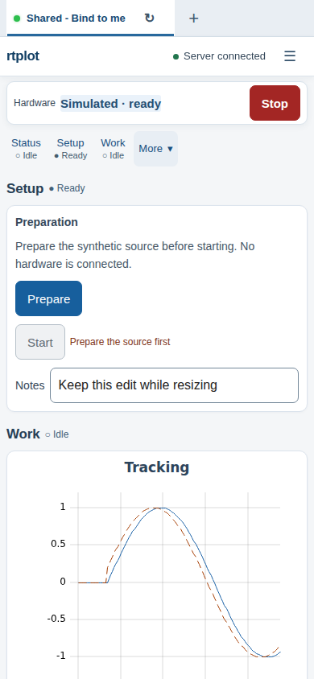

# Before / after presentation

The screenshots use the same synthetic content at each requested viewport.
Before is the 0.5.0 browser (commit `3da6be7`), which ignores the new presentation
options. After uses the responsive presentation implementation. Synthetic samples
continue streaming during capture, so the waveforms are not identical frames.
Phone captures use Chromium mobile emulation with touch enabled.

Open the [side-by-side gallery](index.html), or select an image below.

<table><tr><th>Before · 390×844</th><th>After · 390×844</th></tr>
<tr><td></td>
<td></td></tr></table>

| Viewport | Before | After | After: Advanced expanded and scrolled |
|---|---|---|---|
| 1440×900 | [Before](before-1440x900.png) | [After](after-1440x900.png) | [Expanded](after-advanced-1440x900.png) |
| 1024×768 | [Before](before-1024x768.png) | [After](after-1024x768.png) | [Expanded](after-advanced-1024x768.png) |
| 390×844 | [Before](before-390x844.png) | [After](after-390x844.png) | [Expanded](after-advanced-390x844.png) |
| 320×568 | [Before](before-320x568.png) | [After](after-320x568.png) | [Expanded](after-advanced-320x568.png) |
| 844×390 | [Before](before-844x390.png) | [After](after-844x390.png) | [Expanded](after-advanced-844x390.png) |

Before, the phone's CSS layout viewport was 980 px wide and scaled down. After,
the viewport is the actual 390/320 CSS px, controls remain readable, and document
scroll width equals viewport width at every tested size. The persistent header/essential strip measures **103 px** at the desktop and
portrait sizes, and **95 px** in short landscape, below the respective
144/180/120 px targets. The complete measured
values are in [before-metrics.json](before-metrics.json) and
[after-metrics.json](after-metrics.json).

The automated checks cover touch target dimensions, persistent region budgets,
keyboard focus clearance, zero application commands from presentation operations,
draft/plot preservation, and WCAG AA text contrast for semantic button styles.
These measurements use Chromium at default font scale; other browsers and assistive
technologies have not been exhaustively audited.

To refresh the after set with the local test ports available:

```bash
python tests/capture_presentation.py
```

[API guide](../presentation.md) · [Runnable example](../../examples/07_presentation/README.md)
